<p align="center">
    <a href="https://agdb.agnesoft.com/">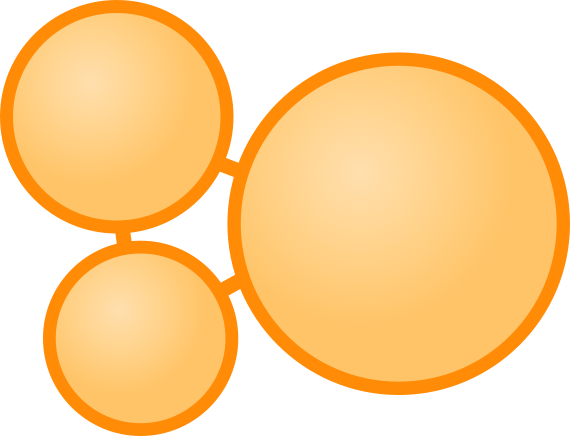</a>
</p>
<h1 align="center">
    agdb
</h1>
<h3 align="center">
    The graph database.
</h3>

<p align="center">
    <a href="https://agdb.agnesoft.com/docs/references/queries">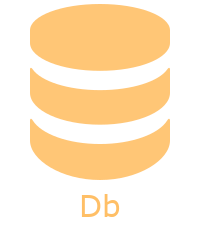</a> &nbsp;&nbsp;&nbsp;&nbsp;&nbsp;
    <a href="https://agdb.agnesoft.com/api-docs/openapi">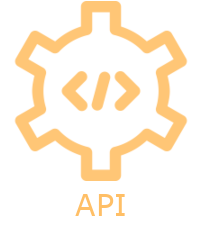</a> &nbsp;&nbsp;&nbsp;&nbsp;&nbsp;
    <a href="https://agdb.agnesoft.com/docs/references/studio"></a> &nbsp;&nbsp;&nbsp;&nbsp;&nbsp;
    <a href="https://agdb.agnesoft.com/docs/references/server">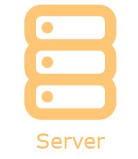</a> &nbsp;&nbsp;&nbsp;&nbsp;&nbsp;
    <a href="https://agdb.agnesoft.com/enterprise/cloud">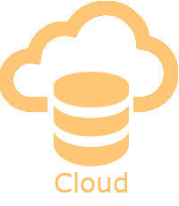</a> 
</p>

<p align="center">
    <a href="https://agdb.agnesoft.com/api-docs/rust"></a>
    <a href="https://agdb.agnesoft.com/api-docs/typescript"></a>
    <a href="https://agdb.agnesoft.com/api-docs/typescript">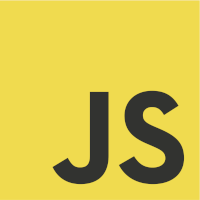</a>
    <a href="https://agdb.agnesoft.com/api-docs/php"></a>
    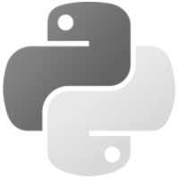
    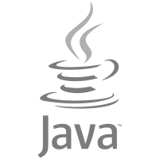
    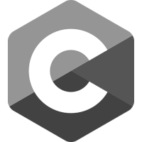
    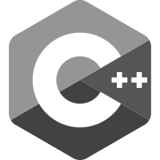
    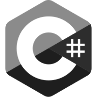
</p>

<p align="center">
    <a href="./LICENSE"></a>
    <a href="https://crates.io/crates/agdb"></a>
    <a href="https://docs.rs/agdb/latest/agdb/"></a>
    <a href="https://github.com/agnesoft/agdb/actions/workflows/release.yaml"></a>
    <a href="https://github.com/agnesoft/agdb/actions/workflows/coverage.yaml"></a>
    <a href="https://codecov.io/gh/agnesoft/agdb"></a>
</p>

<!-- <p align="center">
     &nbsp;
     &nbsp;
     &nbsp;
     &nbsp;
</p> -->

## &nbsp;&nbsp;Agnesoft Graph Database

<p align="center">
    <a href="https://agdb.agnesoft.com/docs/guides/quickstart">Quickstart Db</a> | <a href="https://agdb.agnesoft.com/api-docs/rust">Quickstart Client</a> | <a href="https://agdb.agnesoft.com/docs/references/queries">QUERIES</a> | <a href="#decision-tree">DECISION TREE</a>
</p>
<p align="center">
    <a href="https://agdb.agnesoft.com/blog/blog">Why not SQL?</a>
</p>

The Agnesoft Graph Database (aka _agdb_) is persistent, optionally memory mapped graph database with native object 'no-text' queries. It can be used as a main persistent storage, data analytics platform as well as fast in-memory cache. Its typed schema-less data store allows for flexible and seamless data updates with no downtime or costly migrations. All queries are constructed via a builder pattern or directly as objects with no special language or text parsing.

- [Key Features](#key-features)
- [At a glance](#at-a-glance-db)
- [Crate Features](#crate-features)
- [Decision Tree](#decision-tree)
- [Roadmap](#roadmap)
- [Reference](#reference)

## &nbsp;&nbsp;Key Features

- Data plotted on a graph
- Typed [key-value properties](https://agdb.agnesoft.com/docs/guides/concepts) attached to graph elements (nodes & edges)
- Persistent platform agnostic file based storage (transferable between platforms)
- ACID compliant
- [Object queries](https://agdb.agnesoft.com/docs/references/queries) with builder pattern (no text, no query language)
- Memory mapped for fast querying
- [Server mode](https://agdb.agnesoft.com/docs/references/server)
- [OpenAPI clients](https://agdb.agnesoft.com/api-docs/openapi) in any programming language
- [Cloud](https://agdb.agnesoft.com/enterprise/cloud) hosted SaaS database
- _Db itself has no dependencies_

## &nbsp;&nbsp;At a glance [Db]

```
cargo add agdb
```

Basic usage demonstrating creating a database, inserting graph elements with data and querying them back with select and search. The function using this code must handle `agdb::DbError` and [`agdb::QueryError`](https://agdb.agnesoft.com/docs/references/queries#queryerror) error types for operator `?` to work:

```rs
use agdb::{Db, DbId, QueryBuilder, UserValue, DbUserValue, Comparison::Equal};

let mut db = Db::new("db_file.agdb")?;

db.exec_mut(QueryBuilder::insert().nodes().aliases("users").query())?;

#[derive(Debug, UserValue)]
struct User { db_id: Option<DbId>, name: String, }
let users = vec![User { db_id: None, name: "Alice".to_string(), },
                 User { db_id: None, name: "Bob".to_string(), },
                 User { db_id: None, name: "John".to_string(), }];

let users_ids = db.exec_mut(QueryBuilder::insert().nodes().values(&users).query())?;

db.exec_mut(
    QueryBuilder::insert()
        .edges()
        .from("users")
        .to(&users_ids)
        .query(),
)?;
```

This code creates a database called `user_db.agdb` with a simple graph of 4 nodes. The first node is aliased `users` and 3 user nodes for Alice, Bob and John are then connected with edges to the `users` node. The arbitrary `name` property is attached to the user nodes. Rather than inserting values directly with keys (which is also possible) we use our own type and derive from `agdb::UserValue` to allow it to be used with the database.

You can select the graph elements (both nodes & edges) with their ids to get them back with their associated data (key-value properties). Lets select our users and convert the result into the list (notice we select only values relevant to our `User` type with passing `User::db_keys()`):

```rs
let users: Vec<User> = db
    .exec(
        QueryBuilder::select()
            .values(User::db_keys())
            .ids(&users_ids)
            .query(),
    )?
    .try_into()?;

println!("{:?}", users);
// [User { db_id: Some(DbId(2)), username: "Alice" },
//  User { db_id: Some(DbId(3)), username: "Bob" },
//  User { db_id: Some(DbId(4)), username: "John" }]
```

You can also search through the graph to get back only certain elements based on conditions. For example:

```rs
let user: User = db
    .exec(
        QueryBuilder::select()
            .elements::<User>()
            .search()
            .from("users")
            .where_()
            .key("name")
            .value(Equal("Bob".into()))
            .query(),
    )?
    .try_into()?;

println!("{:?}", user);
// User { db_id: Some(DbId(3)), username: "Bob" }
```

For database concepts and primitive data types see [concepts](https://agdb.agnesoft.com/docs/guides/concepts). For comprehensive overview of all queries see the [queries](https://agdb.agnesoft.com/docs/references/queries) reference or continue with more in-depth [efficient agdb](https://agdb.agnesoft.com/docs/references/efficient-agdb).

## &nbsp;&nbsp;Crate Features

### agdb

| Feature  | Default | Description                                                                                                         |
| -------- | ------- | ------------------------------------------------------------------------------------------------------------------- |
| derive   | yes     | Enables derive macro to enable custom user types to be directly used with the database.                             |
| opeanapi | no      | Enables `ToSchema` macro on query structs so they can be exported to json OpeanAPI/Swagger schema.                  |
| serde    | no      | Enables serialiation/deserialization of queries and QueryResult using [`serde`](https://github.com/serde-rs/serde). |

### agdb_api

| Feature | Default | Description                                                                                                                                 |
| ------- | ------- | ------------------------------------------------------------------------------------------------------------------------------------------- |
| reqwest | no      | Enables referential implementation of the `HttpClient` trait for agdb API client using [`reqwest`](https://github.com/seanmonstar/reqwest). |

## &nbsp;&nbsp;Decision Tree

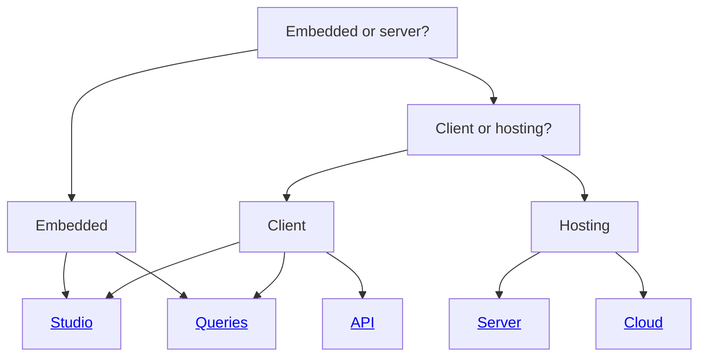

## &nbsp;&nbsp;Roadmap

The following are planned features:

| Feature                               | Description                                                                                                                                          |
| ------------------------------------- | ---------------------------------------------------------------------------------------------------------------------------------------------------- |
| Agdb Studio                           | Graphical interface to `agdb`                                                                                                                        |
| Python Client                         | Convenience client using bindings genereated from OpenAPI.                                                                                           |
| Java Client                           | Convenience client using bindings genereated from OpenAPI.                                                                                           |
| C# Client                             | Convenience client using bindings genereated from OpenAPI.                                                                                           |
| C Client                              | Convenience client using bindings genereated from OpenAPI.                                                                                           |
| C++ Client                            | Convenience client using bindings genereated from OpenAPI.                                                                                           |
| Data replication & consensus protocol | Allow replication by connecting several database nodes together with a RAFT protocol.                                                                |
| Agdb Playground                       | Free public cloud-based playground to tinker with `agdb`.                                                                                            |
| #\[no_std]                            | The `agdb` does not require any dependencies and thus should be (in theory) `no_std` friendly but it will likely require some development & testing. |
| Public Cloud Offering                 | Commercial & supported `agdb` instance hosted in a public cloud.                                                                                     |

## &nbsp;&nbsp;Reference

- [API](https://agdb.agnesoft.com/api-docs/openapi)

- [But why?](https://agdb.agnesoft.com/blog/blog)

- [Cloud](https://agdb.agnesoft.com/enterprise/cloud)

- [Concepts](https://agdb.agnesoft.com/docs/guides/concepts)

- [Efficient agdb](https://agdb.agnesoft.com/docs/references/efficient-agdb)

- [Guides](https://agdb.agnesoft.com/docs/guides)

- [Performance](https://agdb.agnesoft.com/docs/references/performance)

- [Queries](https://agdb.agnesoft.com/docs/references/queries)

- [Server](https://agdb.agnesoft.com/docs/references/server)

- [Studio](https://agdb.agnesoft.com/docs/references/studio)

- [Troubleshooting](https://agdb.agnesoft.com/docs/guides/troubleshooting)
