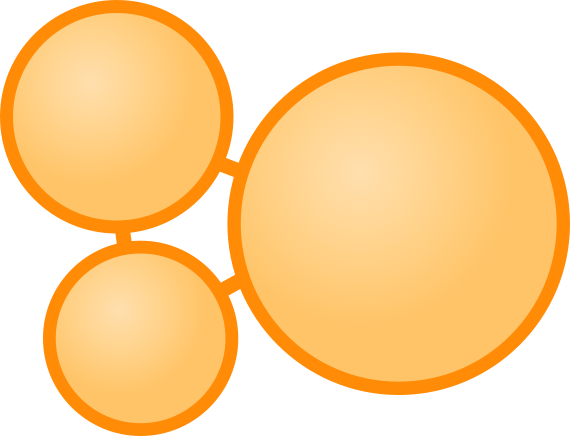
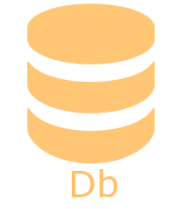
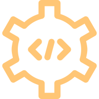
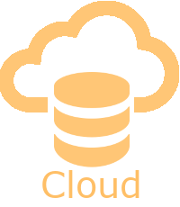
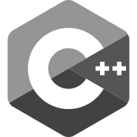
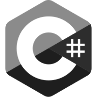

<p align="center">
    
</p>
<h1 align="center">
    agdb
</h1>
<h3 align="center">
    The graph database.
</h3>
<p align="center">
    <a href="https://github.com/agnesoft/agdb/blob/main/LICENSE"></a>
    <a href="https://crates.io/crates/agdb"></a>
    <a href="https://github.com/agnesoft/agdb/actions/workflows/release.yaml"></a>
    <a href="https://github.com/agnesoft/agdb/actions/workflows/coverage.yaml"></a>
    <a href="https://codecov.io/gh/agnesoft/agdb"></a>
</p>
<p align="center"><a href="https://github.com/agnesoft/agdb/blob/main/docs/db.md">DB</a> &nbsp;&nbsp;&nbsp;&nbsp;&nbsp;&nbsp; | &nbsp;&nbsp;&nbsp;&nbsp;&nbsp;&nbsp;<a href="https://github.com/agnesoft/agdb/blob/main/docs/api.md">API</a> &nbsp;&nbsp;&nbsp;&nbsp;&nbsp;&nbsp; | &nbsp;&nbsp;&nbsp;&nbsp;&nbsp;&nbsp; <a href="https://github.com/agnesoft/agdb/blob/main/docs/server.md">SERVER</a> &nbsp;&nbsp;&nbsp;&nbsp;&nbsp;&nbsp; | &nbsp;&nbsp;&nbsp;&nbsp;&nbsp;&nbsp; <a href="https://github.com/agnesoft/agdb/blob/main/docs/db.md">CLOUD</a></p>
<p align="center">
<a href="https://github.com/agnesoft/agdb/blob/main/docs/db.md"></a> <a href="https://github.com/agnesoft/agdb/blob/main/docs/api.md"></a> <a href="https://github.com/agnesoft/agdb/blob/main/docs/server.md"></a>
</p>
<p align="center"><b>Full guides & bindings</b><br/>       </p>

## &nbsp;&nbsp;Agnesoft Graph Database

The Agnesoft Graph Database (aka _agdb_) is persistent memory mapped graph database using object 'no-text' queries. It can be used as a main persistent storage, data analytics platform as well as fast in-memory cache. Its typed schema-less data store allows for flexible and seamless data updates with no downtime or costly migrations. All queries are constructed via a builder pattern (or directly as objects) with no special language or text parsing.

- [Key Features](#key-features)
- [Quickstart](#quickstart)
- [Crate Features](#crate-features)
- [Roadmap](#roadmap)
- [Reference](#reference)
  - [Efficient agdb](docs/efficient_agdb.md)
  - [Performance](docs/performance.md)
  - [Concepts](docs/concepts.md)
  - [Queries](docs/queries.md)
  - [But why?](docs/but_why.md)

## &nbsp;&nbsp;Key Features

- Data plotted on a graph
- Typed [key-value properties](docs/concepts.md#data-types) attached to graph elements (nodes & edges)
- Persistent file based storage
- ACID compliant
- [Object queries](docs/queries.md) with builder pattern (no text, no query language)
- Memory mapped for fast querying
- _No dependencies_

## &nbsp;&nbsp;Quickstart

```
cargo add agdb
```

Basic usage demonstrating creating a database, inserting graph elements with data and querying them back with select and search. The function using this code must handle `agdb::DbError` and [`agdb::QueryError`](docs/queries.md#queryerror) error types for operator `?` to work:

```Rust
use agdb::{Db, DbId, QueryBuilder, UserValue, DbUserValue, Comparison::Equal};

let mut db = Db::new("db_file.agdb")?;

db.exec_mut(&QueryBuilder::insert().nodes().aliases("users").query())?;

#[derive(Debug, UserValue)]
struct User { db_id: Option<DbId>, name: String, }
let users = vec![User { db_id: None, name: "Alice".to_string(), },
                 User { db_id: None, name: "Bob".to_string(), },
                 User { db_id: None, name: "John".to_string(), }];

let users_ids = db.exec_mut(&QueryBuilder::insert().nodes().values(&users).query())?;

db.exec_mut(
    &QueryBuilder::insert()
        .edges()
        .from("users")
        .to(&users_ids)
        .query(),
)?;
```

This code creates a database called `user_db.agdb` with a simple graph of 4 nodes. The first node is aliased `users` and 3 user nodes for Alice, Bob and John are then connected with edges to the `users` node. The arbitrary `name` property is attached to the user nodes. Rather than inserting values directly with keys (which is also possible) we use our own type and derive from `agdb::UserValue` to allow it to be used with the database.

You can select the graph elements (both nodes & edges) with their ids to get them back with their associated data (key-value properties). Lets select our users and convert the result into the list (notice we select only values relevant to our `User` type with passing `User::db_keys()`):

```Rust
let users: Vec<User> = db
    .exec(
        &QueryBuilder::select()
            .values(User::db_keys())
            .ids(&users_ids)
            .query(),
    )?
    .try_into()?;

println!("{:?}", users);
// [User { db_id: Some(DbId(2)), username: "Alice" },
//  User { db_id: Some(DbId(3)), username: "Bob" },
//  User { db_id: Some(DbId(4)), username: "John" }]
```

You can also search through the graph to get back only certain elements based on conditions. For example:

```Rust
let user: User = db
    .exec(
        &QueryBuilder::select()
            .values(User::db_keys())
            .ids(
                QueryBuilder::search()
                    .from("users")
                    .where_()
                    .key("name")
                    .value(Equal("Bob".into()))
                    .query(),
            )
            .query(),
    )?
    .try_into()?;

println!("{:?}", user);
// User { db_id: Some(DbId(3)), username: "Bob" }
```

For database concepts and primitive data types see [concepts](docs/concepts.md). For comprehensive overview of all queries see the [queries](docs/queries.md) reference or continue with more in-depth [efficient agdb](docs/efficient_agdb.md).

## &nbsp;&nbsp;Crate Features

| Feature  | Default | Description                                                                                        |
| -------- | ------- | -------------------------------------------------------------------------------------------------- |
| derive   | yes     | Enables derive macro to enable custom user types to be directly used with the database.            |
| opeanapi | no      | Enables `ToSchema` macro on query structs so they can be exported to json OpeanAPI/Swagger schema. |
| serde    | no      | Enables serialiation/deserialization of queries and QueryResult using `serde`.                     |

## &nbsp;&nbsp;Roadmap

The following are planned features in no particular order:

| Feature                          | Description                                                                                                                                      |
| -------------------------------- | ------------------------------------------------------------------------------------------------------------------------------------------------ |
| Data replication & RAFT protocol | Allow replication by connecting several database nodes together with a RAFT protocol.                                                            |
| Data sharding                    | Allow sharding single database data set across multiple nodes to allow super large databases.                                                    |
| #\[no_std]                       | Since `agdb` does not require any dependencies it should be (in theory) `no_std` friendly but it will likely require some development & testing. |

## &nbsp;&nbsp;Reference

- [Efficient agdb](docs/efficient_agdb.md)

- [Performance](docs/performance.md)

- [Concepts](docs/concepts.md)

- [Queries](docs/queries.md)

- [But why?](docs/but_why.md)
