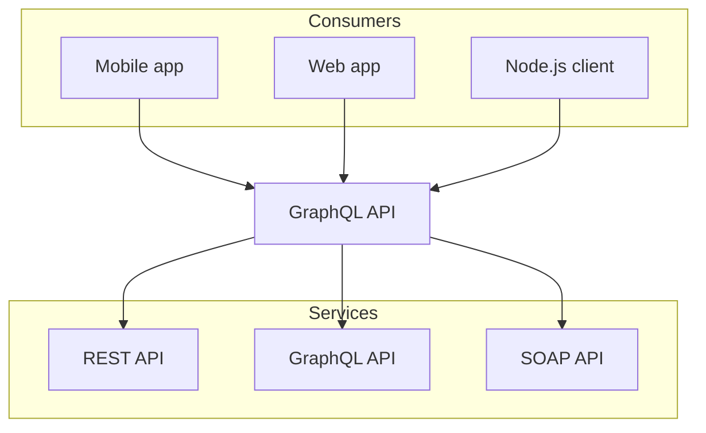

The graph database.

    
    
    
    
    

    <a href="/docs/guides/quickstart">Quickstart</a>
    <a href="/blog/blog">Why agdb?</a>

## Mermaid example

```mermaid
graph TD;
subgraph AA [Consumers]
A[Mobile app];
B[Web app];
C[Node.js client];
end
subgraph BB [Services]
E[REST API];
F[GraphQL API];
G[SOAP API];
end
Z[GraphQL API];
A --> Z;
B --> Z;
C --> Z;
Z --> E;
Z --> F;
Z --> G;
```
