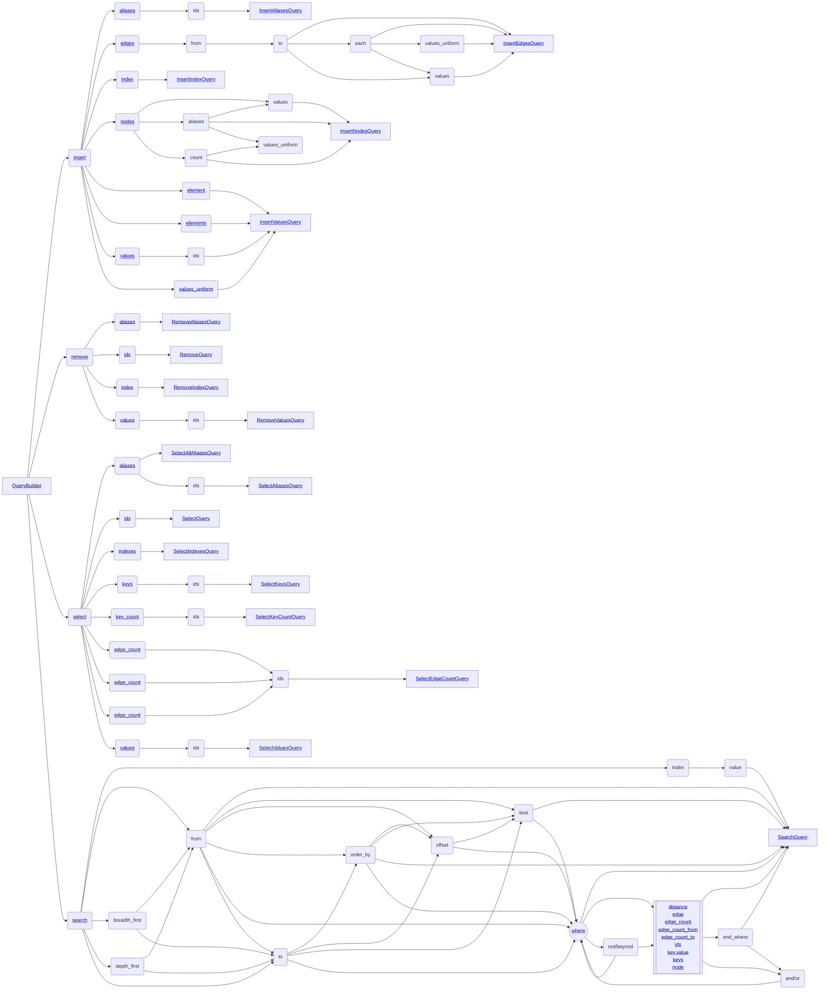

# Queries



- [Queries](#queries)
- [DbUserValue](#dbuservalue)
- [QueryResult](#queryresult)
- [QueryError](#queryerror)
- [Transactions](#transactions)
- [QueryIds \& QueryId](#queryids--queryid)
- [QueryValues](#queryvalues)
- [Mutable queries](#mutable-queries)
  - [Insert](#insert)
    - [Insert aliases](#insert-aliases)
    - [Insert edges](#insert-edges)
    - [Insert index](#insert-index)
    - [Insert nodes](#insert-nodes)
    - [Insert values](#insert-values)
  - [Remove](#remove)
    - [Remove aliases](#remove-aliases)
    - [Remove elements](#remove-elements)
    - [Remove index](#remove-index)
    - [Remove values](#remove-values)
- [Immutable queries](#immutable-queries)
  - [Select](#select)
    - [Select aliases](#select-aliases)
    - [Select all aliases](#select-all-aliases)
    - [Select edge count](#select-edge-count)
    - [Select elements](#select-elements)
    - [Select indexes](#select-indexes)
    - [Select keys](#select-keys)
    - [Select key count](#select-key-count)
    - [Select values](#select-values)
  - [Search](#search)
    - [Conditions](#conditions)
    - [Truth tables](#truth-tables)
      - [And](#and)
      - [Or](#or)
      - [Modifiers](#modifiers)
      - [Results](#results)
    - [Paths](#paths)

All interactions with the `agdb` are realized through queries. There are two kinds of queries:

- Immutable queries
- Mutable queries

Immutable queries read the data from the database through `select` and `search` queries. Mutable queries write to or delete from the database through `insert` and `remove` queries. All queries follow the Rust rules about borrowing:

```
There can be unlimited number of immutable concurrent queries or exactly one mutable query running against the database.
```

The queries are executed against the database by calling the corresponding method on the database object:

```Rust
impl Db {
    // immutable queries only
    pub fn exec<T: Query>(&self, query: &T) -> Result<QueryResult, QueryError>

    // mutable queries only
    pub fn exec_mut<T: QueryMut>(&mut self, query: &T) -> Result<QueryResult, QueryError>
}
```

Alternatively you can run a series of queries as a [transaction](#transactions).

All queries return `Result<QueryResult, QueryError>`. The [`QueryResult`](#queryresult) is the universal data structure holding results of all queries in an uniform structure. The [`QueryError`](#queryerror) is the singular error type holding information of any failure or problem encountered when running the query.

# DbUserValue

The `DbUserValue` trait is an interface that can be implemented for user defined types so that they can be seamlessly used with the database:

```Rust
pub trait DbUserValue: Sized {
    fn db_id(&self) -> Option<DbId>;
    fn db_keys() -> Vec<DbValue>;
    fn from_db_element(element: &DbElement) -> Result<Self, DbError>;
    fn to_db_values(&self) -> Vec<DbKeyValue>;
}
```

Typically you would derive this trait with `agdb::UserValue` procedural macro that uses the field names as keys (of type `String`) and loss-lessly converts the values when reading/writing from/to the database from supported types (e.g. field type `i32` will become `i64` in the database).

It is recommended but optional to have `db_id` field of type `Option<DbId>` in your user defined types which will further allow you to directly update your values with a query shorthands. However it is optional and all other features will still work including conversion from `QueryResult` or passing your types to `values()` in the builders:

```Rust
#[derive(UserValue)]
struct User { db_id: Option<DbId>, name: String, }
let user = User { db_id: None, name: "Bob".to_string() };
db.exec_mut(&QueryBuilder::insert().nodes().values(vec![user]).query())?;
let mut user: User = db.exec(&QueryBuilder::select().values(User::db_keys()).ids(1).query())?.try_into()?; // User { db_id: Some(DbId(1)), name: "Bob" }
user.name = "Alice".to_string();
db.exec_mut(&QueryBuilder::insert().element(&user).query())?; //updates the user element with new name
```

In some cases you may want to implement the `DbUserValue` trait yourself. For example when you want to omit a field or construct it based on other values.

Types not directly used in the database but for which the conversions are supported:

- u32 <=> u64
- i32 <=> i64
- f32 <=> f64
- Vec<i32> <=> Vec<i64>
- Vec<u32> <=> Vec<u64>
- Vec<f32> <=> Vec<f64>
- &str => String (only one way conversion to `String`)
- Vec<&str> => Vec<String> (only one way conversion to `Vec<String>`)

# QueryResult

The `QueryResult` is the universal result type for all successful queries. It can be converted to user defined types that implement [`DbUserValue`](#dbuservalue) with `try_into()`. It looks like this:

```Rust
pub struct QueryResult {
    pub result: i64,
    pub elements: Vec<DbElement>,
}
```

The `result` field holds numerical result of the query. It typically returns the number of database items affected. For example when selecting from the database it will hold a positive number of elements returned. When removing from the database it will hold a negative number of elements deleted from the database. The optional `from` and `to` fields will hold origin/destination id of an edge and will be `None` for nodes.

The `elements` field hold the [database elements](concepts.md#graph) returned. Each element looks like:

```Rust
pub struct DbElement {
    pub id: DbId,
    pub from: Option<DbId>,
    pub to: Option<DbId>,
    pub values: Vec<DbKeyValue>,
}
```

The `id` (i.e. `pub struct DbId(i64)`) is a numerical identifier of a database element. Positive number means the element is a `node` while negative number means the elements is an `edge`. The value `0` is a special value signifying no valid element and is used when certain queries return data not related to any particular element, e.g. aliases.

The values are `key-value` pairs (properties) associated with the given element:

```Rust
pub struct DbKeyValue {
    pub key: DbValue,
    pub value: DbValue,
}
```

Where `DbValue` is:

```Rust
pub enum DbValue {
    Bytes(Vec<u8>),
    I64(i64),
    U64(u64),
    F64(DbF64),
    String(String),
    VecI64(Vec<i64>),
    VecU64(Vec<u64>),
    VecF64(Vec<DbF64>),
    VecString(Vec<String>),
}
```

Note the `DbF64` type (i.e. `pub struct DbF64(f64)`) which is a convenient wrapper of `f64` to provide opinionated implementation of some of the operations that are not floating type friendly like comparisons. In `agdb` the float type is using [`total_cmp` standard library function](https://doc.rust-lang.org/std/primitive.f64.html#method.total_cmp). Please see its documentation for important details about possible limits or issues on certain platforms.

The enum variants can be conveniently accessed through methods named after each variant:

```Rust
fn bytes(&self) -> Result<&Vec<u8>, DbError>;
fn to_f64(&self) -> Result<DbF64, DbError>;
fn to_i64(&self) -> Result<i64, DbError>;
fn to_u64(&self) -> Result<u64, DbError>;
fn to_string(&self) -> String;
fn string(&self) -> Result<&String, DbError>;
fn vec_f64(&self) -> Result<&Vec<DbF64>, DbError>;
fn vec_i64(&self) -> Result<&Vec<i64>, DbError>;
fn vec_u64(&self) -> Result<&Vec<u64>, DbError>;
fn vec_string(&self) -> Result<&Vec<String>, DbError>;

```

The numerical variants (`I64`, `U64`, `DbF64`) will attempt loss-less conversions where possible. To avoid copies all other variants return `&` where conversions are not possible even if they could be done in theory. The special case is `to_string()` provided by the `Display` trait. It converts any values into string (it also copies the `String` variant) and performs possibly lossy conversion from `Bytes` to UTF-8 string.

# QueryError

Failure when running a query is reported through a single `QueryError` object which can optionally hold internal error (or chain of errors) that led to the failure. Most commonly it will represent **data error** or **logic error** in your query. Less commonly it may also report a failure to perform the requested operation due to underlying infrastructure issue (e.g. out of memory). It is up to the client code to handle the error.

# Transactions

You can run a series of queries as a transaction invoking corresponding methods on the database object:

```Rust
impl Db {
    // immutable transactions
    pub fn transaction<T, E>(&self, mut f: impl FnMut(&Transaction) -> Result<T, E>) -> Result<T, E>

    // mutable transactions
    pub fn transaction_mut<T, E: From<QueryError>>(&mut self, mut f: impl FnMut(&mut TransactionMut) -> Result<T, E>) -> Result<T, E>
}
```

The transaction methods take a closure that itself takes a transaction object as an argument. This is to prevent long lived transactions and force them to be as concise as possible. The transaction objects implement much the same methods as the `Db` itself (`exec` / `exec_mut`). It is not possible to nest transactions but you can run immutable queries within a mutable transaction `TransactionMut`.

Note that you cannot manually abort, rollback or commit the transaction. These are handled by the database itself based on the result of the closure. If it's `Ok` the transaction will be committed (in case `mutable` queries as there is nothing to commit for `immutable` queries). If the result is `Err` the transaction will be rolled back.

In both cases the result will be returned and the signature of the transaction methods allows for custom mapping of the default `Result<QueryResult, QueryError>` to an arbitrary `<T, E>` result-error pair.

Worth noting is that regular `exec / exec_mut` methods on the `Db` object are actually implemented as transactions.

# QueryIds & QueryId

Most queries operate over a set of database ids. The `QueryIds` type is actually an enum:

```Rust
pub enum QueryIds {
    Ids(Vec<QueryId>),
    Search(SearchQuery),
}
```

It represents either a set of actual `ids` or a `search` query that will be executed as the larger query and its results fed as ids to the larger query. The `QueryId` is defined as another enum:

```Rust
pub enum QueryId {
    Id(DbId),
    Alias(String),
}
```

This is because you can refer to the database elements via their numerical identifier or by the `string` alias (name). The `DbId` is then just a wrapper type: `pub struct DbId(pub i64)`. Both `QueryIds` and `QueryId` can be constructed from large number of different types like raw `i64`, `&str`, `String` or vectors of those etc.

# QueryValues

The `QueryValues` is a an enum type that makes a distinction between singular and multiple values like so:

```Rust
pub enum QueryValues {
    Single(Vec<DbKeyValue>),
    Multi(Vec<Vec<DbKeyValue>>),
}
```

This is especially important because it can change the meaning of query making use of this type. For example when inserting elements into the database and supplying `QueryValues::Single` all the elements will have the copy of the single set of properties associated with them. Conversely `QueryValues::Multi` will initialize each element with a different provided set of properties bu the number of inserted elements and the number of property sets must then match (it would be a query logic error if they did not match and the query would fail with such an error).

# Mutable queries

Mutable queries are the way to modify the data in the database. Remember there can only be a mutable query running against the database at any one time preventing all other mutable or immutable queries running concurrently. There are two types of mutable queries:

- insert
- remove

The `insert` queries are used for both insert and updating data while `remove` queries are used to delete data from the database.

## Insert

There are 5 distinct insert queries:

- insert aliases
- insert edges
- insert nodes
- insert index
- insert values

### Insert aliases

<table><tr><td><b>Struct</b></td><td><b>Result</b></td></tr>
<tr><td>

```Rust
pub struct InsertAliasesQuery {
    pub ids: QueryIds,
    pub aliases: Vec<String>,
}
```

</td><td>

```Rust
pub struct QueryResult {
    pub result: i64, // number of inserted/updated aliases
    pub elements: Vec<DbElement>, // empty
}
```

</td></tr><tr><td colspan=2><b>Builder</b></td></tr><tr><td colspan=2>

```Rust
QueryBuilder::insert().aliases("a").ids(1).query();
QueryBuilder::insert().aliases("a").ids("b").query(); // alias "b" is replaced  with "a"
QueryBuilder::insert().aliases(vec!["a", "b"]).ids(vec![1, 2]).query();
```

</td></tr></table>

Inserts or updates aliases of existing nodes (and only nodes, edges cannot have aliases) through this query. It takes `ids` [`QueryIds`](#queryids--queryid) and list of `aliases` as arguments. The number of aliases must match the `ids` (even if they are a search query). Empty alias (`""`) are not allowed.

Note that this query is also used for updating existing aliases. Byt inserting a different alias of an id that already has one that alias will be overwritten with the new one.

### Insert edges

<table><tr><td><b>Struct</b></td><td><b>Result</b></td></tr>
<tr><td>

```Rust
pub struct InsertEdgesQuery {
    pub from: QueryIds,
    pub to: QueryIds,
    pub values: QueryValues,
    pub each: bool,
}
```

</td><td>

```Rust
pub struct QueryResult {
    pub result: i64, // number of inserted edges
    pub elements: Vec<DbElement>, // list of inserted edges (only ids)
}
```

</td></tr><tr><td colspan=2><b>Builder</b></td></tr><tr><td colspan=2>

```Rust
QueryBuilder::insert().edges().from(1).to(2).query();
QueryBuilder::insert().edges().from("a").to("b").query();
QueryBuilder::insert().edges().from("a").to(vec![1, 2]).query();
QueryBuilder::insert().edges().from(vec![1, 2]).to(vec![2, 3]).query();
QueryBuilder::insert().edges().from(vec![1, 2]).to(vec![2, 3]).each().query();
QueryBuilder::insert().edges().from("a").to(vec![1, 2]).values(vec![vec![("k", 1).into()], vec![("k", 2).into()]]).query();
QueryBuilder::insert().edges().from("a").to(vec![1, 2]).values_uniform(vec![("k", "v").into(), (1, 10).into()]).query();
QueryBuilder::insert().edges().from(QueryBuilder::search().from("a").where_().node().query()).to(QueryBuilder::search().from("b").where_().node().query()).query();
QueryBuilder::insert().edges().from(QueryBuilder::search().from("a").where_().node().query()).to(QueryBuilder::search().from("b").where_().node().query()).values(vec![vec![("k", 1).into()], vec![("k", 2).into()]]).query();
QueryBuilder::insert().edges().from(QueryBuilder::search().from("a").where_().node().query()).to(QueryBuilder::search().from("b").where_().node().query()).values_uniform(vec![("k", "v").into(), (1, 10).into()]).query();
```

</td></tr></table>

The `from` and `to` represents list of origins and destinations of the edges to be inserted. As per [`QueryIds`](#queryids--queryid) it can be a list, single value, search query or even a result of another query (e.g. [insert nodes](#insert-nodes)) through the call of convenient `QueryResult::ids()` method. All ids must be `node`s and all must exist in the database otherwise data error will occur. If the `values` is [`QueryValues::Single`](#queryvalues) all edges will be associated with the copy of the same properties. If `values` is [`QueryValues::Multi`](#queryvalues) then the number of edges being inserted must match the provided values otherwise a logic error will occur. By default the `from` and `to` are expected to be of equal length specifying at each index the pair of nodes to connect with an edge. If all-to-all is desired set the `each` flag to `true`. The rule about the `values` [`QueryValues::Multi`](#queryvalues) still applies though so there must be enough values for all nodes resulting from the combination. The values can be inferred from user defined types if they implement `DbUserValue` trait (`#derive(agdb::UserValue)`). Both singular nad vectorized versions are supported.

### Insert index

<table><tr><td><b>Struct</b></td><td><b>Result</b></td></tr>
<tr><td>

```Rust
pub struct InsertIndexQuery(pub DbValue);
```

</td><td>

```Rust
pub struct QueryResult {
    pub result: i64, // number of indexed values
    pub elements: Vec<DbElement>, // empty
}
```

</td></tr><tr><td colspan=2><b>Builder</b></td></tr><tr><td colspan=2>

```Rust
QueryBuilder::insert().index("key").query();
```

</td></tr></table>

Creates an index for a key. The index is valid for the entire database including any and all existing values in the database. The purpose of the index is to provide faster lookup for data that is not modelled on the graph itself. Example can be looking up users by their username or token.

### Insert nodes

<table><tr><td><b>Struct</b></td><td><b>Result</b></td></tr>
<tr><td>

```Rust
pub struct InsertNodesQuery {
    pub count: u64,
    pub values: QueryValues,
    pub aliases: Vec<String>,
}
```

</td><td>

```Rust
pub struct QueryResult {
    pub result: i64, // number of inserted nodes
    pub elements: Vec<DbElement>, // list of inserted nodes (only ids)
}
```

</td></tr><tr><td colspan=2><b>Builder</b></td></tr><tr><td colspan=2>

```Rust
QueryBuilder::insert().nodes().count(2).query();
QueryBuilder::insert().nodes().count(2).values_uniform(vec![("k", "v").into(), (1, 10).into()]).query();
QueryBuilder::insert().nodes().aliases(vec!["a", "b"]).query();
QueryBuilder::insert().nodes().aliases(vec!["a", "b"]).values(vec![vec![("k", 1).into()], vec![("k", 2).into()]]).query();
QueryBuilder::insert().nodes().aliases(vec!["a", "b"]).values_uniform(vec![("k", "v").into(), (1, 10).into()]).query();
QueryBuilder::insert().nodes().values(vec![vec![("k", 1).into()], vec![("k", 2).into()]]).query();
```

</td></tr></table>

The `count` is the number of nodes to be inserted into the database. It can be omitted (left `0`) if either `values` or `aliases` (or both) are provided. If the `values` is [`QueryValues::Single`](#queryvalues) you must provide either `count` or `aliases`. It is a logic error if the count cannot be inferred and is set to `0`. If both `values` [`QueryValues::Multi`](#queryvalues) and `aliases` are provided their lengths must match, otherwise it will result in a logic error. Empty alias (`""`) are not allowed. The values can be inferred from user defined types if they implement `DbUserValue` trait (`#derive(agdb::UserValue)`). Both singular nad vectorized versions are supported.

### Insert values

<table><tr><td><b>Struct</b></td><td><b>Result</b></td></tr>
<tr><td>

```Rust
pub struct InsertValuesQuery {
    pub ids: QueryIds,
    pub values: QueryValues,
}
```

</td><td>

```Rust
pub struct QueryResult {
    pub result: i64, // number of inserted key-value pairs
    pub elements: Vec<DbElement>, // empty
}
```

</td></tr><tr><td colspan=2><b>Builder</b></td></tr><tr><td colspan=2>

```Rust
QueryBuilder::insert().element(&T { ... }).query(); //Where T: DbUserValue (i.e. #derive(UserValue))
QueryBuilder::insert().elements(&vec![T {...}, T {...}]).query(); //Where T: DbUserValue (i.e. #derive(UserValue))
QueryBuilder::insert().values(vec![vec![("k", "v").into(), (1, 10).into()], vec![("k", 2).into()]]).ids(vec![1, 2]).query();
QueryBuilder::insert().values(vec![vec![("k", "v").into(), (1, 10).into()], vec![("k", 2).into()]]).ids(QueryBuilder::search().from("a").query()).query();
QueryBuilder::insert().values_uniform(vec![("k", "v").into(), (1, 10).into()]).ids(vec![1, 2]).query();
QueryBuilder::insert().values_uniform(vec![("k", "v").into(), (1, 10).into()]).ids(QueryBuilder::search().from("a").query()).query();
```

</td></tr></table>

Inserts or updates key-value pairs (properties) of existing elements. You need to specify the `ids` [`QueryIds`](#queryids--queryid) and the list of `values`. The `values` can be either [`QueryValues::Single`](#queryvalues) that will insert the single set of properties to all elements identified by `ids` or [`QueryValues::Multi`](#queryvalues) that will insert to each `id` its own set of properties but their number must match the number of `ids`. If the user defined type contains `db_id` field of type `Option<DbId>` you can use the shorthand `insert().element() / .insert().elements()` that will infer the values and ids from your types. All the rules as if specified manually still apply (e.g. the ids must exist in the database). The `values()` can be inferred from user defined types if they implement `DbUserValue` trait (`#derive(agdb::UserValue)`). Both singular nad vectorized versions are supported.

Note that this query is also used for updating existing values. By inserting the same `key` its old value will be overwritten with the new one.

## Remove

There are 4 distinct remove queries:

- remove aliases
- remove (elements)
- remove index
- remove values

### Remove aliases

<table><tr><td><b>Struct</b></td><td><b>Result</b></td></tr>
<tr><td>

```Rust
pub struct RemoveAliasesQuery(pub Vec<String>);
```

</td><td>

```Rust
pub struct QueryResult {
    pub result: i64, // negative number of removed aliases
    pub elements: Vec<DbElement>, // empty
}
```

</td></tr><tr><td colspan=2><b>Builder</b></td></tr><tr><td colspan=2>

```Rust
QueryBuilder::remove().aliases("a").query();
QueryBuilder::remove().aliases(vec!["a", "b"]).query();
```

</td></tr></table>

The aliases listed will be removed from the database if they exist. It is NOT an error if the aliases do not exist in the database.

### Remove elements

<table><tr><td><b>Struct</b></td><td><b>Result</b></td></tr>
<tr><td>

```Rust
pub struct RemoveQuery(pub QueryIds);
```

</td><td>

```Rust
pub struct QueryResult {
    pub result: i64, // negative number of removed ids
                     // (does not include removed edges
                     // unless listed in query ids)
    pub elements: Vec<DbElement>, // empty
}
```

</td></tr><tr><td colspan=2><b>Builder</b></td></tr><tr><td colspan=2>

```Rust
QueryBuilder::remove().ids(1).query();
QueryBuilder::remove().ids("a").query();
QueryBuilder::remove().ids(vec![1, 2]).query();
QueryBuilder::remove().ids(vec!["a", "b"]).query();
QueryBuilder::remove().ids(QueryBuilder::search().from("a").query()).query();
```

</td></tr></table>

The elements identified by [`QueryIds`](#queryids--queryid) will be removed from the database if they exist. It is NOT an error if the elements to be removed do not exist in the database. All associated properties (key-value pairs) are also removed from all elements. Removing nodes will also remove all their edges (incoming and outgoing) and their properties.

### Remove index

<table><tr><td><b>Struct</b></td><td><b>Result</b></td></tr>
<tr><td>

```Rust
pub struct RemoveIndexQuery(pub DbValue);
```

</td><td>

```Rust
pub struct QueryResult {
    pub result: i64, // negative number of values removed
                     // from the index
    pub elements: Vec<DbElement>, // empty
}
```

</td></tr><tr><td colspan=2><b>Builder</b></td></tr><tr><td colspan=2>

```Rust
QueryBuilder::remove().index("key").query()
```

</td></tr></table>

Removes an index from the database. It is NOT an error if the index does not exist in the database.

### Remove values

<table><tr><td><b>Struct</b></td><td><b>Result</b></td></tr>
<tr><td>

```Rust
pub struct RemoveValuesQuery(pub SelectValuesQuery);
```

</td><td>

```Rust
pub struct QueryResult {
    pub result: i64, // negative number of actually removed
                     // key-value pairs
    pub elements: Vec<DbElement>, // empty
}
```

</td></tr><tr><td colspan=2><b>Builder</b></td></tr><tr><td colspan=2>

```Rust
QueryBuilder::remove().values(vec!["k1".into(), "k2".into()]).ids(vec![1, 2]).query();
QueryBuilder::remove().values(vec!["k1".into(), "k2".into()]).ids(QueryBuilder::search().from("a").query()).query();
```

</td></tr></table>

NOTE: See [`SelectValuesQuery`](#select-values) for more details.

The properties (key-value pairs) identified by `keys` and associated with `ids` [`QueryIds`](#queryids--queryid) will be removed from the database if they exist. It is an error if any of the `ids` do not exist in the database but it is NOT an error if any of the keys does not exist or is not associated as property to any of the `ids`.

# Immutable queries

Immutable queries read the data from the database and there can be unlimited number of concurrent queries running against the database at the same time. There are two types of immutable queries:

- select
- search

The `select` queries are used to read the data from the database using known `id`s of elements. The `search` queries are used to find the `id`s and the result of search queries is thus often combined with the `select` queries.

## Select

There are following select queries:

- select aliases
- select all aliases
- select edge count
- select (elements)
- select indexes
- select keys
- select key count
- select values

### Select aliases

<table><tr><td><b>Struct</b></td><td><b>Result</b></td></tr>
<tr><td>

```Rust
pub struct SelectAliasesQuery(pub QueryIds);
```

</td><td>

```Rust
pub struct QueryResult {
    pub result: i64, // number of returned elements
    pub elements: Vec<DbElement>, // list of elements each with
                                  // a single property
                                  // (`String("alias")`: `String`)
}
```

</td></tr><tr><td colspan=2><b>Builder</b></td></tr><tr><td colspan=2>

```Rust
QueryBuilder::select().aliases().ids(vec![1, 2]).query();
QueryBuilder::select().aliases().ids(QueryBuilder::search().from(1).query()).query();
```

</td></tr></table>

Selects aliases of the `ids` [`QueryIds`](#queryids--queryid) or a search. If any of the ids does not have an alias running the query will return an error.

### Select all aliases

<table><tr><td><b>Struct</b></td><td><b>Result</b></td></tr>
<tr><td>

```Rust
pub struct SelectAllAliasesQuery {}
```

</td><td>

```Rust
pub struct QueryResult {
    pub result: i64, // number of elements with aliases
    pub elements: Vec<DbElement>, // list of elements with an
                                  // alias each with a single
                                  // property (`String("alias"): String`)
}
```

</td></tr><tr><td colspan=2><b>Builder</b></td></tr><tr><td colspan=2>

```Rust
QueryBuilder::select().aliases().query()
```

</td></tr></table>

Selects all aliases in the database.

### Select edge count

<table><tr><td><b>Struct</b></td><td><b>Result</b></td></tr>
<tr><td>

```Rust
pub struct SelectEdgeCountQuery {
    pub ids: Ids,
    pub from: bool,
    pub to: bool
}
```

</td><td>

```Rust
pub struct QueryResult {
    pub result: i64, // number of elements with aliases
    pub elements: Vec<DbElement>, // list of elements with an
                                  // alias each with a single
                                  // property (`String("edge_count"): String`)
}
```

</td></tr><tr><td colspan=2><b>Builder</b></td></tr><tr><td colspan=2>

```Rust
QueryBuilder::select().edge_count().ids(vec![1, 2]).query()
QueryBuilder::select().edge_count_from().ids(vec![1, 2]).query()
QueryBuilder::select().edge_count_to().ids(vec![1, 2]).query()
```

</td></tr></table>

Selects count of edges of nodes (ids). The `edge_count` variant counts all edges (outgoing & incoming). The `edge_count_from` counts only outgoing edges. The `edge_count_to` counts only incoming edges.

NOTE: Self-referential edges (going from the same node to the same node) will be counted twice in the first variant (`edge_count`) as the query counts ountgoing/incoming edges rather than unique database elements. As a result the `edge_count` result may be higher than the actual number of physical edges in such a case.

### Select elements

<table><tr><td><b>Struct</b></td><td><b>Result</b></td></tr>
<tr><td>

```Rust
pub struct SelectQuery(pub QueryIds);
```

</td><td>

```Rust
pub struct QueryResult {
    pub result: i64, // number of returned elements
    pub elements: Vec<DbElement>, // list of elements with
                                  // all properties
}
```

</td></tr><tr><td colspan=2><b>Builder</b></td></tr><tr><td colspan=2>

```Rust
QueryBuilder::select().ids("a").query();
QueryBuilder::select().ids(vec![1, 2]).query();
QueryBuilder::select().ids(QueryBuilder::search().from(1).query()).query();
```

</td></tr></table>

Selects elements identified by `ids` [`QueryIds`](#queryids--queryid) or search query with all their properties. If any of the ids does not exist in the database running the query will return an error. The search query is most commonly used to find, filter or otherwise limit what elements to select.

### Select indexes

<table><tr><td><b>Struct</b></td><td><b>Result</b></td></tr>
<tr><td>

```Rust
pub struct SelectIndexesQuery {};
```

</td><td>

```Rust
pub struct QueryResult {
    pub result: i64, // number of indexes in the database
    pub elements: Vec<DbElement>, // single element with id 0 and list of
                                  // properties representing each index
                                  // (`DbValue`: `u64`) where the key is
                                  // the indexed key and the value is number
                                  // of indexed values in the index.
}
```

</td></tr><tr><td colspan=2><b>Builder</b></td></tr><tr><td colspan=2>

```Rust
QueryBuilder::select().indexes().query();
```

</td></tr></table>

Selects all indexes in the database.

### Select keys

<table><tr><td><b>Struct</b></td><td><b>Result</b></td></tr>
<tr><td>

```Rust
pub struct SelectKeysQuery(pub QueryIds);
```

</td><td>

```Rust
pub struct QueryResult {
    pub result: i64, // number of returned elements
    pub elements: Vec<DbElement>, // list of elements with only keys
                                  // defaulted values will be `I64(0)`
}
```

</td></tr><tr><td colspan=2><b>Builder</b></td></tr><tr><td colspan=2>

```Rust
QueryBuilder::select().keys().ids("a").query();
QueryBuilder::select().keys().ids(vec![1, 2]).query();
QueryBuilder::select().keys().ids(QueryBuilder::search().from(1).query()).query();
```

</td></tr></table>

Selects elements identified by `ids` [`QueryIds`](#queryids--queryid) or search query with only keys returned. If any of the ids does not exist in the database running the query will return an error. This query is most commonly used for establishing what data is available in on the graph elements (e.g. when transforming the data into a table this query could be used to populate the column names).

### Select key count

<table><tr><td><b>Struct</b></td><td><b>Result</b></td></tr>
<tr><td>

```Rust
pub struct SelectKeyCountQuery(pub QueryIds);
```

</td><td>

```Rust
pub struct QueryResult {
    pub result: i64, // number of returned elements
    pub elements: Vec<DbElement>, // list of elements each with a
                                  // single property
                                  // (`String("key_count")`: `u64`)
}
```

</td></tr><tr><td colspan=2><b>Builder</b></td></tr><tr><td colspan=2>

```Rust
QueryBuilder::select().key_count().ids("a").query();
QueryBuilder::select().key_count().ids(vec![1, 2]).query();
QueryBuilder::select().key_count().ids(QueryBuilder::search().from(1).query()).query();
```

</td></tr></table>

Selects elements identified by `ids` [`QueryIds`](#queryids--queryid) or search query with only key count returned. If any of the ids does not exist in the database running the query will return an error. This query is most commonly used for establishing how many properties there are associated with the graph elements.

### Select values

<table><tr><td><b>Struct</b></td><td><b>Result</b></td></tr>
<tr><td>

```Rust
pub struct SelectValuesQuery {
    pub keys: Vec<DbValue>,
    pub ids: QueryIds,
}
```

</td><td>

```Rust
pub struct QueryResult {
    pub result: i64, // number of returned elements
    pub elements: Vec<DbElement>, // list of elements with only
                                  // selected properties
}
```

</td></tr><tr><td colspan=2><b>Builder</b></td></tr><tr><td colspan=2>

```Rust
QueryBuilder::select().values(vec!["k".into(), "k2".into()]).ids("a").query();
QueryBuilder::select().values(vec!["k".into(), "k2".into()]).ids(vec![1, 2]).query();
QueryBuilder::select().values(vec!["k".into(), "k2".into()]).ids(QueryBuilder::search().from(1).query()).query();
```

</td></tr></table>

Selects elements identified by `ids` [`QueryIds`](#queryids--queryid) or search query with only selected properties (identified by the list of keys). If any of the ids does not exist in the database or does not have all the keys associated with it then running the query will return an error. While the search query is most commonly used to find, filter or otherwise limit what elements to select, using this particular query can limit what properties will be returned. If you plan to convert the result into your user defined type(s) you should use `T::db_keys()` provided through the `DbUserValue` trait (`#derive(UserValue)`) as argument to `values()`.

## Search

<table><tr><td><b>Struct</b></td><td><b>Result</b></td></tr>
<tr><td>

```Rust
pub struct SearchQuery {
    pub algorithm: SearchQueryAlgorithm,
    pub origin: QueryId,
    pub destination: QueryId,
    pub limit: u64,
    pub offset: u64,
    pub order_by: Vec<DbKeyOrder>,
    pub conditions: Vec<QueryCondition>,
}
```

</td><td>

```Rust
pub struct QueryResult {
    pub result: i64, // number of elements found
    pub elements: Vec<DbElement>, // list of elements found (only ids)
}
```

</td></tr><tr><td>

```Rust
pub enum SearchQueryAlgorithm {
    BreadthFirst,
    DepthFirst,
    Index,
}

pub enum DbKeyOrder {
    Asc(DbValue),
    Desc(DbValue),
}
```

</td><td></td></tr><tr><td colspan=2><b>Builder</b></td></tr><tr><td colspan=2>

```Rust
QueryBuilder::search().from("a").query();
QueryBuilder::search().to(1).query(); //reverse search
QueryBuilder::search().from("a").to("b").query(); //path search using A* algorithm
QueryBuilder::search().breadth_first().from("a").query(); //breadth first is the default and can be omitted
QueryBuilder::search().depth_first().from("a").query();
QueryBuilder::search().index("age").value(20).query(); //index search
//limit, offset and order_by can be applied similarly to all the search variants
QueryBuilder::search().from(1).order_by(vec![DbKeyOrder::Desc("age".into()), DbKeyOrder::Asc("name".into())]).query()
QueryBuilder::search().from(1).offset(10).query();
QueryBuilder::search().from(1).limit(5).query();
QueryBuilder::search().from(1).order_by(vec![DbKeyOrder::Desc("k".into())]).offset(10).query();
QueryBuilder::search().from(1).order_by(vec![DbKeyOrder::Desc("k".into())]).limit(5).query();
QueryBuilder::search().from(1).order_by(vec![DbKeyOrder::Desc("k".into())]).offset(10).limit(5).query();
QueryBuilder::search().from(1).offset(10).limit(5).query();
```

</td></tr></table>

There is only a single search query that provides the ability to search the graph or indexes. When searching the graph it examines connected elements and their properties. While it is possible to construct the search queries manually, specifying conditions manually in particular can be excessively difficult and therefore **using the builder pattern is recommended**. The default search algorithm is `breadth first` however you can choose to use `depth first`. For path search the `A*` algorithm is used. For searching an index the algorithm is `index`.

If the index search is done the graph traversal is skipped entirely as are most of the parameters including like limit, offset, ordering and conditions.

The graph search query is made up of the `origin` and `destination` of the search and the algorithm. Specifying only `origin` (from) will result in a search along `from->to` edges. Specifying only `destination` (to) will result in the reverse search along the `to<-from` edges. When both `origin` and `destination` are specified the search algorithm becomes a path search and the algorithm used will be `A*`. Optionally you can specify a `limit` (0 = unlimited) and `offset` (0 = no offset) to the returned list of graph element ids. If specified (!= 0) the `origin` and the `destination` must exist in the database, otherwise an error will be returned. The elements can be optionally ordered with `order_by` list of keys allowing ascending/descending ordering based on multiple properties.

Finally the list of `conditions` that each examined graph element must satisfy to be included in the result (and subjected to the `limit` and `offset`).

**NOTE:** When both `origin` and `destination` are specified and the algorithm is switched to the `A*` the `limit` and `offset` are applied differently. In regular (open-ended) search the search will end when the `limit` is reached but with the path search (A\*) the `destination` must be reached first before they are applied.

### Conditions

<table><tr><td><b>Struct</b></td></tr>
<tr><td>

```Rust
pub struct QueryCondition {
    pub logic: QueryConditionLogic,
    pub modifier: QueryConditionModifier,
    pub data: QueryConditionData,
}

pub enum QueryConditionLogic {
    And,
    Or,
}

pub enum QueryConditionModifier {
    None,
    Beyond,
    Not,
    NotBeyond,
}

pub enum QueryConditionData {
    Distance(CountComparison),
    Edge,
    EdgeCount(CountComparison),
    EdgeCountFrom(CountComparison),
    EdgeCountTo(CountComparison),
    Ids(Vec<QueryId>),
    KeyValue { key: DbValue, value: Comparison },
    Keys(Vec<DbValue>),
    Node,
    Where(Vec<QueryCondition>),
}

pub enum CountComparison {
    Equal(u64),
    GreaterThan(u64),
    GreaterThanOrEqual(u64),
    LessThan(u64),
    LessThanOrEqual(u64),
    NotEqual(u64),
}

pub enum Comparison {
    Equal(DbValue),
    GreaterThan(DbValue),
    GreaterThanOrEqual(DbValue),
    LessThan(DbValue),
    LessThanOrEqual(DbValue),
    NotEqual(DbValue),
    Contains(DbValue),
}
```

</td></tr><tr><td><b>Builder</b></td></tr><tr><td>

```Rust
//the where_() can be applied to any of the basic search queries after order_by/offset/limit
//not() and not_beyond() can be applied to all conditions including nested where_()
QueryBuilder::search().from(1).where_().distance(CountComparison::LessThan(3)).query();
QueryBuilder::search().from(1).where_().edge().query();
QueryBuilder::search().from(1).where_().edge_count(CountComparison::GreaterThan(2))().query();
QueryBuilder::search().from(1).where_().edge_count_from(CountComparison::Equal(1))().query();
QueryBuilder::search().from(1).where_().edge_count_to(CountComparison::NotEqual(1))().query();
QueryBuilder::search().from(1).where_().node().query();
QueryBuilder::search().from(1).where_().key("k").value(Comparison::Equal(1.into())).query();
QueryBuilder::search().from(1).where_().keys(vec!["k1".into(), "k2".into()]).query();
QueryBuilder::search().from(1).where_().not().keys(vec!["k1".into(), "k2".into()]).query();
QueryBuilder::search().from(1).where_().ids(vec![1, 2]).query();
QueryBuilder::search().from(1).where_().beyond().keys(vec!["k"]).query();
QueryBuilder::search().from(1).where_().not().ids(vec![1, 2]).query();
QueryBuilder::search().from(1).where_().not_beyond().ids("a").query();
QueryBuilder::search().from(1).where_().node().or().edge().query();
QueryBuilder::search().from(1).where_().node().and().distance().query(CountComparison::GreaterThanOrEqual(3)).query();
QueryBuilder::search().from(1).where_().node().or().where_().edge().and().key("k").value(Comparison::Equal(1.into())).end_where().query();
QueryBuilder::search().from(1).where_().node().or().where_().edge().and().key("k").value(Comparison::Contains(1.into())).end_where().query();
QueryBuilder::search().from(1).where_().node().or().where_().edge().and().key("k").value(Comparison::Contains(vec![1, 2].into())).end_where().query();
```

</td></tr></table>

The currently supported conditions are:

- Where (opens nested list of conditions)
- Edge (if the element is an `edge`)
- Node (if the element is a `node`)
- Distance (if the current distance of the search satisfies the numerical comparison, each graph element away from the start increases the distance, including edges, i.e. second node from start is at distance `2`)
- EdgeCount (if the element is a node and total number of edges (in and out) satisfies the numerical comparison - self-referential edges are counted twice)
- EdgeCountFrom (if the element is a node and total number of outgoing edges satisfies the numerical comparison)
- EdgeCountTo (if the element is a node and total number of incoming edges satisfies the numerical comparison)
- Ids (if the element id is in the list)
- KeyValue (if the element's property has the `key` and its value satisfies `value` comparison)
- Keys (if the element has all the `keys` regardless of their values)
- EndWhere (closes nested list of conditions)

All conditions can be further modified as follows:

- Beyond (continues the search only beyond this element)
- Not (reverses the condition result)
- NotBeyond (stops the search beyond this element)

The conditions can be changed with logic operators:

- And (logical `and`)
- Or (logical `or`)

NOTE: The use of `where_` with an underscore as the method name is necessary to avoid conflict with the Rust keyword.

The conditions are applied one at a time to each visited element and chained using logic operators `AND` and `OR`. They can be nested using `where_` and `end_where` (in place of brackets). The condition evaluator supports short-circuiting not evaluating conditions further if the logical outcome cannot change. The condition comparators are type strict meaning that they do not perform type conversions nor coercion (e.g. `Comparison::Equal(1_i64).compare(1_u64)` will evaluate to `false`). Slight exception to this rule is the `Comparison::Contains` as it allows vectorized version of the base type (e.g. `Comparison::Contains(vec!["bc", "ef"]).compare("abcdefg")` will evaluate to `true`).

The condition `Distance` and the condition modifiers `Beyond` and `NotBeyond` are particularly important because they can directly influence the search. The former (`Distance`) can limit the depth of the search and can help with constructing more elaborate queries (or sequence thereof) extracting only fine grained elements (e.g. nodes whose edges have particular properties or are connected to other nodes with some properties). The latter (`Beyond` and `NotBeyond`) can limit search to only certain areas of an otherwise larger graph. Its most basic usage would be with condition `ids` to flat out stop the search at certain elements or continue only beyond certain elements.

### Truth tables

The following information should help with reasoning about the query conditions. Most of it should be intuitive but there are some aspects that might not be obvious especially when combining logic operators and condition modifiers. The search is using the following `enum` when evaluating conditions:

```Rust
pub enum SearchControl {
    Continue(bool),
    Finish(bool),
    Stop(bool),
}
```

The type controls the search and the boolean value controls if the given element should be included in a search result. The `Stop` will prevent the search expanding beyond current element (stopping the search in that direction). `Finish` will immediately exit the search returning accumulated elements (ids) and is only used internally with `offset` and `limit` (NOTE: path search and `order_by` still require complete search regardless of `limit`).

Each condition contributes to the final control result as follows with the starting/default value being always `Continue(true)`:

#### And

| Left           | Right           | Result                  |
| -------------- | --------------- | ----------------------- |
| Continue(left) | Continue(right) | Continue(left && right) |
| Continue(left) | Stop(right)     | Stop(left && right)     |
| Continue(left) | Finish(right)   | Finish(left && right)   |
| Stop(left)     | Stop(right)     | Stop(left && right)     |
| Stop(left)     | Finish(right)   | Finish(left && right)   |
| Finish(left)   | Finish(right)   | Finish(left && right)   |

#### Or

| Left           | Right           | Result                    |
| -------------- | --------------- | ------------------------- |
| Continue(left) | Continue(right) | Continue(left \|\| right) |
| Continue(left) | Stop(right)     | Continue(left \|\| right) |
| Continue(left) | Finish(right)   | Continue(left \|\| right) |
| Stop(left)     | Stop(right)     | Stop(left \|\| right)     |
| Stop(left)     | Finish(right)   | Stop(left \|\| right)     |
| Finish(left)   | Finish(right)   | Finish(left \|\| right)   |

#### Modifiers

Modifiers will change the result of a condition based on the control value (the boolean) as follows:

| Modifier  | TRUE                | FALSE                  |
| --------- | ------------------- | ---------------------- |
| None      | -                   | -                      |
| Beyond    | `&& Continue(true)` | `\|\| Stop(false)`     |
| Not       | `!`                 | `!`                    |
| NotBeyond | `&& Stop(true)`     | `\|\| Continue(false)` |

#### Results

Most conditions result in `Continue(bool)` except for `distance()` and nested `where()` which can also result in `Stop(bool)`:

| Condition   | Continue | Stop |
| ----------- | -------- | ---- |
| Where       | YES      | YES  |
| Edge        | YES      | NO   |
| Node        | YES      | NO   |
| Distance    | YES      | YES  |
| EdgeCount\* | YES      | NO   |
| Ids         | YES      | NO   |
| Key(Value)  | YES      | NO   |
| Keys        | YES      | NO   |

### Paths

Path search (`from().to()`) uses A\* algorithm. Every element (node or edge) has a cost of `1` by default. If it passes all the conditions (the `SearchControl` value `true`) the cost will remain `1` and would be included in the result (if the path it is on would be selected). If it fails any of the conditions (the `SearchControl` value `false`) its cost will be `2`. This means that the algorithm will prefer paths where elements match the conditions rather than the absolutely shortest path (that can be achieved with no conditions). If the search is not to continue beyond certain element (through `beyond()`, `not_beyond()` or `distance()` conditions) its cost will be `0` and the paths it is on will no longer be considered for that search.

---

For further examples and use cases see the [efficient agdb](docs/efficient_agdb.md).
