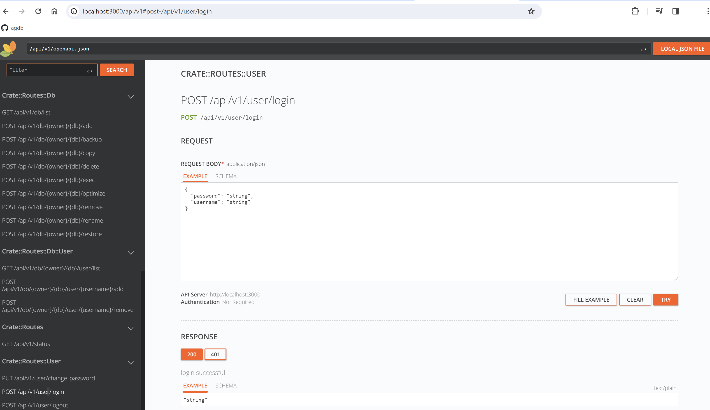

# Server

- [How to run he server?](/agdb_web/content/en/docs/1.guides/4.how_to_run_server.md)
- [Configuration](#configuration)
- [Users](#users)
- [Databases](#databases)
  - [Database Users](#database-users)
  - [Database Actions](#database-actions)
  - [Backups](#backups)
  - [Queries](#queries)
- [Admin](#admin)
- [Shutdown](#shutdown)
- [Misc](#misc)

The `agdb_server` is the OpenAPI REST server that provides remote `agdb` database management. Running the server is trivial as there are no dependencies, no complicated configuration etc. It can be run on any platform supported by Rust. Please follow the guide:

[How to run he server?](/agdb_web/content/en/docs/1.guides/4.how_to_run_server.md)

The server is based on [`axum`](https://github.com/tokio-rs/axum) and uses OpenAPI to specify its API (via [`utoipa`](https://github.com/juhaku/utoipa)) and [`rapidoc`](https://rapidocweb.com/) for the OpenAPI GUI. To interact with the server you can use the rapidoc GUI, `curl` or any of the [available API clients](/agdb_api/). Internally it uses the `agdb` database:

GUI accessible at (run in browser when the server is running):

`http://localhost:3000/api/v1`



## Configuration

The server will create default configuration when run:

```yaml
# agdb_server.yaml
host: localhost # host address to listen on
port: 3000 # port to bind to
admin: admin # the admin user that will be created automatically for the server, the password will be the same as name (admin by default, recommended to change after startup)
data_dir: agdb_server_data # directory to store user data
```

You can prepare it in advance in a file `agdb_server.yaml`. After the server database is created changes to the `admin` field will have no effect but the other settings can be changed later. All config changes require server restart to take effect.

## Users

The server has a single admin account (`admin` by default, configurable with password being the name) that can perform any regular user action + all admin actions such as creating users. You can use this account for using the database locally but it would be advisable to use it only for maintaining the server and to create a regular user for use with the databases:

```bash
 # produce an admin API token, e.g. "bb2fc207-90d1-45dd-8110-3247c4753cd5"
token=$(curl -X POST -H 'Content-Type: application/json' localhost:3000/api/v1/user/login -d '{"username":"admin","password":"admin"}')
# using admin token to create a user
curl -X POST -H "Authorization: Bearer ${token}" localhost:3000/api/v1/admin/user/my_db_user/add -d '{"password":"password123"}'
# login as the new user and producing their token
token=$(curl -X POST -H 'Content-Type: application/json' localhost:3000/api/v1/user/login -d '{"username":"my_db_user","password":"password123"}')
```

Users are allowed to change their password and to create and manipulate databases.

Available user APIs:

| Action                       | Description                                         |
| ---------------------------- | --------------------------------------------------- |
| /api/v1/user/change_password | changes the current user's password                 |
| /api/v1/user/login           | logs in the user returning an API token             |
| /api/v1/user/logout          | logs out the user and invalidating the API token \* |

The login is shared meaning if you login twice even from different devices you will get the same sahred API token of that user. Similarly when the `logout` endpoint is used this token is invalidated across all sessions.

## Databases

Any user can create, remove and manipulate their own databases. To create a database:

```bash
curl -X POST -H "Authorization: Bearer ${token}" localhost:3000/api/v1/db/my_db_owner/my_db/add?db_type=mapped
```

Note that a user can only create databases under their own name. The `db_type` can be one of:

```yaml
memory # memory only database, basically a cache
mapped # memory mapped database, using memory for reading but persisting changes to the disk
file # file based database only, no memory caching, reading/writing from/to disk
```

It is possible to add an existing database to the server. Move the db file to the server data folder and run `/api/v1/db/{owner}/{db}/add` API as if you were creating a new database with the db's name. If the file exists it will be added rather than created. Similarly you can remove database (instead of deleting it) from the server with `/api/v1/db/{owner}/{db}/remove` API that will disassociate the db from the server which you can then move and use elsehwere.

### Database Users

Each database is scoped to one user (owner) who can excercise full control over it. The owner can add more users (they must exist on the server) to the database including admin level users with one of three roles:

```yaml
read # can only run immutable exec queries
write # can run mutable and immutable exec queries
admin # same as write but can also admin the database
```

The admin users can do some (but not all) actions that the owner can:

### Database Actions

| Action                              | Permission | Description                                                                                      |
| ----------------------------------- | ---------- | ------------------------------------------------------------------------------------------------ |
| /api/v1/db/{owner}/{db}/list        | read       | lists the databases with role of the current user (owned and others')                            |
| /api/v1/db/{owner}/{db}/add         | owner      | adds (from existing files) or creates a database                                                 |
| /api/v1/db/{owner}/{db}/backup      | admin      | creates an automatic backup snapshot of the database (see backup docs below)                     |
| /api/v1/db/{owner}/{db}/copy        | read       | creates a copy of the database under the current user                                            |
| /api/v1/db/{owner}/{db}/delete      | owner      | deletes the database including files on disk                                                     |
| /api/v1/db/{owner}/{db}/exec        | read\*     | executes queries against the database (\*read permissions only allow immutable queries)          |
| /api/v1/db/{owner}/{db}/optimize    | write      | optimizes the underlying file storage packing the data reclaiming unused regions (defragmenting) |
| /api/v1/db/{owner}/{db}/remove      | owner      | removes the database from the server but keeps the files on disk (main, WAL, backup)             |
| /api/v1/db/{owner}/{db}/rename      | owner      | changes the name of the database (this API can be used to transfer db ownership!)                |
| /api/v1/db/{owner}/{db}/restore     | admin      | restores the database from the automatic backup - the current database will become the backup    |
| /api/v1/db/{owner}/{db}/audit       | read       | returns the log of all mutable queries that ran against the database (with user who ran them)    |
| /api/v1/db/{owner}/{db}/user/list   | read       | list users of the database with their roles                                                      |
| /api/v1/db/{owner}/{db}/user/add    | admin      | adds a user to the database                                                                      |
| /api/v1/db/{owner}/{db}/user/remove | admin      | removes a user from the database                                                                 |

### Backups

Each database can be backed up. The backup API `/api/v1/db/{owner}/{db}/backup` has no parameters and will always backup the database under the same name to the "backups" subfolder in the owner's data. The database can be restored with `/api/v1/db/{owner}/{db}/restore` at which point the existing backup will become the main database and the current database will become the backup so it is not possible to "lose" the current state even if accidentally "restoring". You can revert to the state before backup by running another `/api/v1/db/{owner}/{db}/restore`. If you need more granular backup or multiple backups you can devise your own scheme using the `/api/v1/db/{owner}/{db}/copy`, `/api/v1/db/{owner}/{db}/rename` and possibly `/api/v1/db/{owner}/{db}/remove` or `/api/v1/db/{owner}/{db}/delete` APIs.

### Queries

All queries are executed using the single `/api/v1/db/{owner}/{db}/exec` endpoint and are exactly the same as in the embedded/application database (see [Queries documentation](/docs/queries.md)). However depending on the user's role the server may reject executing the queries (i.e. mutable queries executed by the user with `read` role in the database). The endpoint accepts a list of queries and the entire list is run as a transaction meaning either all queries succeed or none of them do. The endpoint will return list of results, one per executed query.

It is possible to reference queries from each other in the list and the server will inject results of the referenced queries to the next one. This is slight extension to the vanilla `agdb` queries. It is best illustrated by an example:

```rs
let queries = &vec![
    QueryBuilder::insert().nodes().count(1).query().into(), // :0
    QueryBuilder::insert().nodes().count(1).query().into(), // :1
    QueryBuilder::insert().edges().from(":0").to(":1").query().into(), // :2
    QueryBuilder::search().from(":0").to(":1").query().into(), //:3
];
```

In places where the `alias` can be used (an `ids` identifier) you can use an index prefixed by `:` to inject result of the previous query in the list. In the example we are inserting two separate nodes and then creating an edge between them and finally searching from one node to the other. An index to the results can be used in most places including conditions. What is currently not possible is to inject data (i.e. key-value properties) from results to subsequent queries.

**Transactions**

While the server serves each request asynchronously and can serve any number of clients at the same time the queries and individual databases must still follow the basic principles of the `agdb` that are the same as in the embedded variant (and derived from Rust itself):

There can be either:

- unlimited amount of immutable transactions
- exactly one mutable transaction

However the `agdb` is written in such a way that it performs excellently even under heavily contested read/write load. See `agdb_benchmarks` and [performance documentation](/docs/performance.md).

## Admin

Each `agdb_server` has exactly one admin account (`admin` by default) that acts as the regular user but additonally is allowed to execute APIs under `/admin/`. These mostly copies the APIs for regular users but some of the restrictions are not enforced (i.e. ownership or db role). Additionally the admin has access to the following exclusive APIs:

| Action                                        | Description                                                                      |
| --------------------------------------------- | -------------------------------------------------------------------------------- |
| /api/v1/admin/shutdown                        | gracefully shuts down the server                                                 |
| /api/v1/admin/user/list                       | lists the all users on the server                                                |
| /api/v1/admin/user/{username}/add             | adds new user to the server                                                      |
| /api/v1/admin/user/{username}/change_password | changes password of a user                                                       |
| /api/v1/admin/user/{username}/remove          | deletes user and all their data (databases) from the server                      |
| /api/v1/admin/db/\*                           | provides same endpoints as for regular users but without owner/role restrictions |

## Shutdown

The server can be gracefully shutdown with `CTRL+C` or programmatically by using the `/api/v1/admin/shutdown` endpoint which requires admin token, e.g.

```bash
token=$(curl -X POST -H 'Content-Type: application/json' localhost:3000/api/v1/user/login -d '{"username":"admin","password":"admin"}') #will produce a token, e.g. "bb2fc207-90d1-45dd-8110-3247c4753cd5"
curl -X POST -H "Authorization: Bearer ${token}" localhost:3000/api/v1/admin/shutdown
```

## Misc

Following are the special or miscellanerous endpoints:

| Endpoint             | Description                                          |
| -------------------- | ---------------------------------------------------- |
| /api/v1              | serves rapidoc OpenAPI GUI (use this in the browser) |
| /api/v1/status       | returns 200 OK if the server is ready (up)           |
| /api/v1/openapi.json | returns the server's OpenAPI specification as json   |
